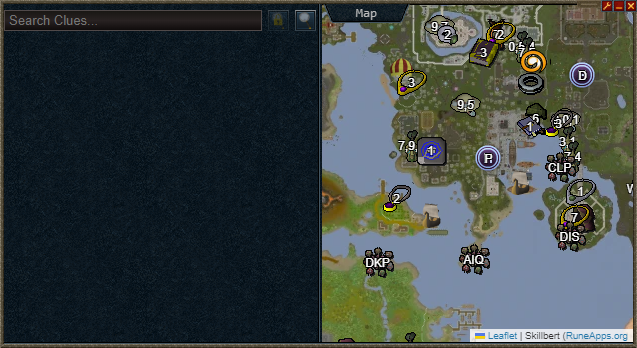
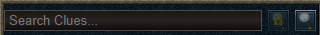
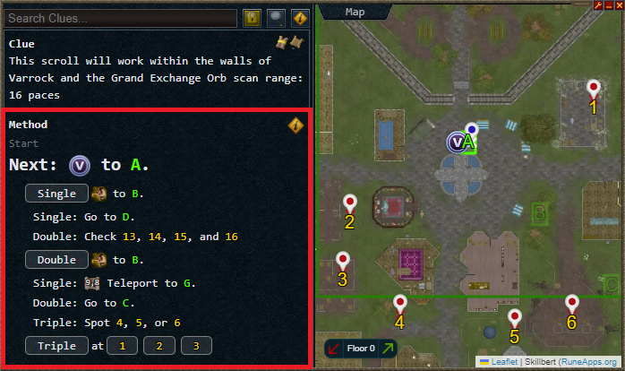

## NOTE: Clue Trainer is currently in public beta and not feature complete yet. Expect incomplete/missing guides, errors and bugs.

# Clue Trainer

Clue Trainer is a plugin for the [Alt1 toolkit](https://runeapps.org/) by Skillbert.
Its main function is guiding players through efficiently solving scan steps in elite and master clues.


## How to use

Use the search bar to select a scan clue, or use the screen reader with the buttons to the right to automatically read your active clue from screen.



After selecting a clue, a method panel on the left will open.


Follow the directions in the method panel and click the button corresponding to what information you receive at that spot.
The search tree will advance, ruled out spots will gray out in the map, and it will zoom into the next relevant area. 


Also note how the section of the search tree you are in is displayed above the current instructions.
Use the links there to navigate back up the search tree if you need to.

Continue to follow the directions until you receive a triple ping and have found the spot, or the plugin tells you to dig at a specific spot because only one candidate remains.
When there are no more instructions, but multiple spots left, you need to manually check them.
This is usually the case for scan spots in close proximity to each other or for spots you should use a globetrotter charge for.

**The included methods only work when you have summoned a Meerkats familiar to boost your scan range by 5 tiles. This is NOT optional.**


### How does this work?

All possible spots for scan clues are publically known.
This allows us to find scan routes that can narrow down the spots that need to be considered quickly without having to search the entire area. 
At any given point, you can see if the spot you are looking for is within 1x the scan range (triple ping), within 2x the scan range (double ping) or beyond 2x the scan range (single ping). 
By chaining together standing spots strategically, a [ternary search tree](https://en.wikipedia.org/wiki/Ternary_search_tree) can be created for each scan area.
Smart people like Fiery have done so and kindly provided optimal strategies to the public.

The plugin visualizes these trees by highlighting where to stand, telling you how to efficiently get there, and visually removing the dig spots that no longer need to be considered. It is intended to be used as a tool to help memorize the paths to solve elite clues faster than ever before.

## Getting Started

The live version can be viewed at https://leridon.github.io/cluetrainer-live/.

To install Scan Trainer into Alt1, open this (full) link in your browser:

```alt1://addapp/https://leridon.github.io/cluetrainer-live/appconfig.json```

or open https://leridon.github.io/cluetrainer-live/ inside of the Alt1 browser.

## The Scan Editor

Version b0.3 introduced an editor for scan routes, that is available when the app is opened in a regular browser (outside Alt1). It has a lot of tooling to create scan routes and understand scans even better.
There is no guide on how to use the editor yet, but feel free to reach out if you have any questions about it.
It can be accessed by selecting any scan and clicking the button in the top right corner of the map.

## Feedback and Contributions

To provide feedback, get support with issues or provide contributions, you can reach out to me at [Clue Chasers Discord/#scan-trainer](https://discord.com/channels/332595657363685377/1103737270114209825).

You can also use the issue system directly here at GitHub.

## Credits

A huge thanks to [Skillbert](https://github.com/skillbert) for creating Alt1 in the first place and especially for allowing me to use code and data from the official clue solver, as well as for providing high quality map data for the world map.

Also thanks to the guide writers and theorycrafters over at the [Clue Chasers Discord](https://discord.gg/cluechasers) for providing the clue knowledge, especially Fiery whose scan routes are visualized in this plugin.

## Future Plans

Plans for the immediate future are to finish mapping the remaining scan routes and improve how the instructions are conveyed. Other planned features are the ability to configure teleports like the official Alt1 map does and 

Longer term plans (no guarantees) are inclusion of solving methods for other clue types than just scans.
