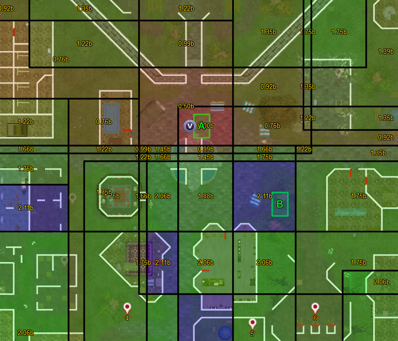

# Equivalence Classes



Some connected tiles in a scan region can be seen as equivalent.
If you step from one tile to another, without any of the possible scan spots crossing changing pulse type, both tiles can be seen as equivalent.
Put another way, two tiles are in the same equivalence class, when for every possible dig spot they produce the exact same pulse type when stood in.

Equivalence classes are distinguished by a thing I call a scan profile.
The scan profile of a tile is the list of pulse types for all remaining candidate spots and with 4 remaining dig spots, it may look like this: `[1, 3, 2, 2]`
An equivalence class is made up of all tiles with the exact same scan profile.

As spots are ruled out, scan profiles and therefore equivalence classes change.
Only spots that are actually still possible with the information gained already need to be considered for scan profiles.

Equivalence classes are visualized by drawing their shape as an overlay on the map.


## A bit of information theory

Equivalence classes can be taken a step further.
They can be rated with respect to the amount of information you can expect to gain there.
To understand this, let's take a (brief) look at information theory and binary encoding.

Let's say you invented a new alphabet with 32 letters and want to find an encoding that matches every letter to a number, represented in binary with the digits 0 and 1.
You will need 5 digits to have enough unique combinations to cover all 32 letters (`2^5 = 32`), so you need 5 bit to encode your alphabet.
If you write down the encoding for a letter (say `10011`), and read from left to right, after reading the first digit (`1`), there are only 16 possibilities left that string of digits can refer to, namely all letters whose binary encoding starts with a `1`. 
By reading the first digit, we have therefore split the number of candidates in half and gained 1 bit of information.
The information we gain when narrowing down candidates from previously `n` to `m` generalizes to `log2(n/m)`.

So, what does this have to do with scan clues?
In this analogy, the possible dig spots of a scan region make the alphabet we want to encode.
The pulses we observe when standing in an equivalence class equate to reading digits of an encoded string.
The difference is that we are not reading exactly one bit and not every type of pulse carries the same amount of information.

Let's say there are 16 dig spots in a scan, and the first area we stand in has a scan profile of `[3, 3, 3, 2, 2, 2, 2, 2, 2, 2, 1, 1, 1, 1, 1, 1]`
To uniquely identify on of the 16 dig spots, we need to collect 4 bit of information.
When receiving a triple pulse at the first spot we stand in, we have immediately gathered all the information we need.
There are 7 spots leading to a double pulse, so a double pulse narrows down the search space from 16 to 7 spots, so we would gain `log2(16/7) = 1.19` bit of information.
For a single pulse, that would be `log2(16/6) = 1.42` bit.

The information value of an equivalence class, can then be calculated by computing the average/expected amount of information we gain by weighing the individual information gains by the probability of that pulse type occuring.
Now, this assumes that every scan spot is equally likely to occur, which we have no reason to believe is not the case.

```
export function information_gain(n_singles, n_doubles, n_triples) {
    let gain = 0
    
    let total = n_singles + n_doubles + n_triples

    if (n_singles > 0) gain += Math.log2(total / n_singles) * (n_singles / total)
    if (n_doubles > 0) gain += Math.log2(total / n_doubles) * (n_doubles / total)
    
    // Triples are special: They narrow down to exactly one candidate instead of all triple candidates.
    if (n_triples > 0) gain += Math.log2(total) * (n_triples / total)  

    return gain
}
```

Equivalence classes are labeled with their information value and also colored accordingly from red (low information value) to green (high information value).
Classes tied for the most expected information gain are colored blue.